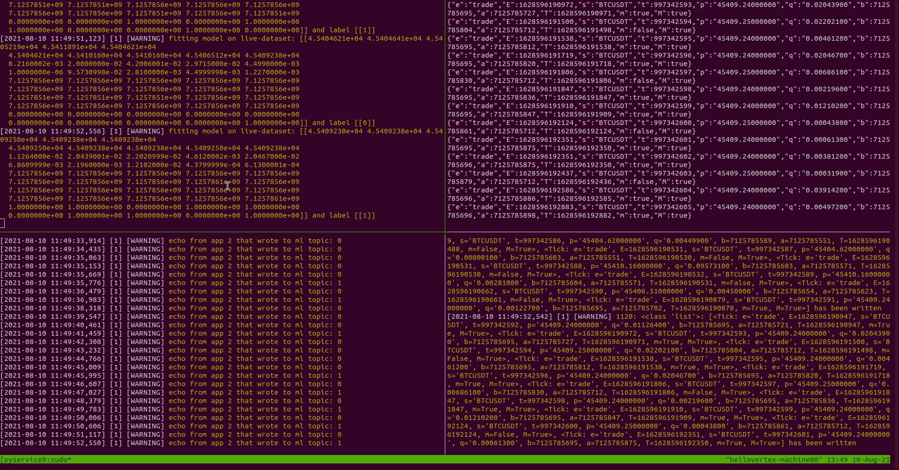

[comment]: <> (# I-PAT: Infrastructure POC for Algorithmic Trading)

# saftd - Streaming Architecture for Financial and Trading Data

[](https://travis-ci.org/hellovertex/tmp)

[Service Oriented Architecture](https://en.wikipedia.org/wiki/Service-oriented_architecture) for Algorithmic Trading and Financial Machine Learning (Experimental)
- based on microservices by definition
- every service can be run isolated via docker-compose run <service-name>

### [Features](#features) · [Install](#install) · [Run Example](#run-example) · [Todos](#todos)


## Features


- Top right: live trade-ticks incoming via websocket
- Bottom right: asynchronously update databases with incoming ticks
- Bottom left: preprocessing computes ML data+labels and sends to new kafka topic
- Top left: machine learning service consumes training data directly from kafka topic (can be changed) \
  - Online model fitting in realtime (numbers shown here are random mocks)

Note: all of the above can be deployed in the cloud - as is

## Install
  - [install docker](https://docs.docker.com/engine/install/)
  - [install docker-compose](https://docs.docker.com/compose/install/)
  - clone the repo
```sh
git clone https://github.com/hellovertex/saftd.git
``` 

## Run-Example
```sh
cd src
# start zookeeper
docker-compose run zookeeper && sleep(3) \
# start kafka broker
&& docker-compose run kafka && sleep(2) \
# run data collection service
&& docker-compose run data
```
Check out the docker-compose.yml file to find other services implement, e.g. '''aggregate, db, preprocess, ml''' and run them via
```sh
docker-compose run <SERVICE_NAME>
```

## Todos:
This project is still in an early stage, I will add things over time, including but not limited to 
- typehints, pylint, tests
- continous deployment of retrained models 
	 - using airflow (already running, see docker-compose.yml) with github actions
- trigger BI-actions 
	 - based on model-eval & custom metrics
- integrate additional data feeds 
	 - e.g. Telegram (see my tgcxz on github)
- run with kubernetes

[comment]: <> (# If you have questions, feel free to create an Issue here on github or write an email to hellovertex@outlook.com)

